# 🌍 EVENT-CONTEXT: Global News Intelligence Engine
### *(Evolving Vectorized Entities in News Texts - CONtextual Topic EXtraction Technique)*

**EVENT-CONTEXT** is an automated news analysis system that collects global headlines from RSS feeds, applies AI-driven topic modeling (BERTopic), and generates daily intelligence reports with interactive visualizations.

Designed for researchers, analysts, and globally-minded citizens, it transforms raw news into structured insights — revealing trends, topic relationships, and global event dynamics.

🔍 **URL**: [github.io/event-context/](https://jluisvim.github.io/event-context/)

---

## 🚀 Features

- ✅ **Daily news collection** from international RSS sources
- 🔍 **Topic modeling** using BERTopic (NLP + sentence transformers)
- 📊 **Interactive visualizations**: topic evolution, co-occurrence, semantic similarity
- 📅 **Historical tracking** with date-based reports
- 🖼️ **Self-contained HTML reports** with embedded plots
- 🤖 **Fully automated** via GitHub Actions (runs every 24h)
- 🌐 **GitHub Pages ready**: no external hosting required
- 💾 **Open & transparent**: all data and code are versioned

---

## 🧠 How It Works

1. **Collect**: Fetches news titles from RSS feeds (e.g., BBC, Reuters, NYT).
2. **Cluster**: Uses BERTopic to group headlines into dynamic, interpretable topics.
3. **Analyze**: Computes topic co-occurrence and semantic similarity.
4. **Visualize**: Generates interactive Plotly charts and static heatmaps.
5. **Publish**: Builds standalone HTML reports in `docs/`.
6. **Automate**: GitHub Actions runs the pipeline daily and opens a PR.

> All results are saved by date in `data/daily/`, `results/daily/`, and `docs/`.

---

## 🔄 Workflow Diagram

```mermaid
flowchart TD
    A[📡 1. Load RSS Feeds] --> B[🌐 2. Fetch News]
    B --> C[🤖 3. BERTopic Modeling]
    C --> D[📊 4. Topic Analysis]
    D --> E[🔗 Co-occurrence Matrix]
    D --> F[🧠 Semantic Similarity]
    D --> G[📈 Topic Evolution]
    E --> H[📂 Save Results]
    F --> H
    G --> H
    H --> I[🌍 Generate HTML Report]
    I --> J[📝 Update Index Page]
    J --> K[🚀 GitHub Pages Deployment]
```

---

## 📈 Example Output

Each day, you get:
- A **topic model** with labels like `"China-Taiwan Tensions"` or `"Global Energy Crisis"`
- A **time series chart** showing how topics evolve
- A **co-occurrence matrix** of related topics
- A **semantic similarity heatmap**
- A **daily HTML report** with all insights
- An **index page** linking to historical reports

---

## 🛠️ Tech Stack

| Component | Technology |
|--------|------------|
| News Collection | `feedparser` + RSS |
| Topic Modeling | `BERTopic` + `sentence-transformers` |
| NLP | `all-MiniLM-L6-v2` (embedding model) |
| Visualization | `plotly`, `seaborn`, `matplotlib` |
| Automation | GitHub Actions |
| Output Format | Static HTML (GitHub Pages compatible) |
| Hosting | GitHub Pages (`docs/` folder) |

---

## 🌟 Future Improvements

- [ ] **Multilingual news processing** – Extend analysis to non-English RSS feeds using multilingual embedding models (e.g., `paraphrase-multilingual-MiniLM-L12-v2`)
- [ ] **GDELT integration** – Incorporate structured global event data from the GDELT Project for deeper geopolitical context
- [ ] **Sentiment analysis per topic** – Add emotional tone detection using VADER or transformer-based sentiment models
- [ ] **Topic alert system** – Get notified when specific topics (e.g., "conflict", "elections") emerge or spike
- [ ] **Searchable archive** – Add full-text search across historical reports using Lunr.js or FlexSearch
- [ ] **Geospatial visualization** – Map news coverage by country using interactive maps (Plotly, Leaflet)
- [ ] **User feedback loop** – Allow readers to label topics or relevance for semi-supervised improvement

---

## 📎 Author

**JLVM**  
[GitHub @jluisvim](https://github.com/jluisvim)  

